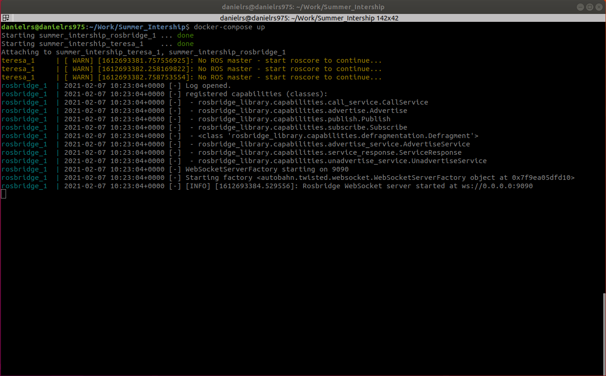

# Robot Controller written in Python
- [Robot Controller written in Python](#robot-controller-written-in-python)
- [Description](#description)
  - [Architecture](#architecture)
  - [Tools used](#tools-used)
- [Setting up the environment](#setting-up-the-environment)
  - [Prerequisites](#prerequisites)
  - [Set up](#set-up)
- [Running the environments](#running-the-environments)
  - [For the Teresa Robot](#for-the-teresa-robot)
    - [Prerequisites](#prerequisites-1)
    - [Executing the simulation (Without Docker)](#executing-the-simulation-without-docker)
    - [Executing the simulation (With Docker)](#executing-the-simulation-with-docker)
- [Troubleshooting](#troubleshooting)
- [Author and Advisor](#author-and-advisor)
- [Note about this project](#note-about-this-project)

# Description
It is a simple robot controller that allows to send commands to a set of robots and also extract information about the sensors. For now it only works with Gazebo simulator.
## Architecture
In the following image is an overview of the project architecture. 

## Tools used
One library it is used to connect with the ROS Server, ```roslibpy``` ([See docs here](https://roslibpy.readthedocs.io/en/latest/reference/index.html)).
# Setting up the environment
## Prerequisites
You must have installed:
- Python 3
- Docker Engine 19.03.13, ([Install docker](https://docs.docker.com/engine/install/ubuntu/))
- Docker Compose 1.26.2, ([Install docker-compose](https://docs.docker.com/compose/install/))
- Virtualenv, you can install it with the following command: ```sudo apt-get install virtualenv```

## Set up
1) Clone this repository.
2) Create a folder inside the project called ```venv```
3) Create a virtual environment with the ```virtualenv``` command. Example: ```virtualenv --python=python3 venv/```
4) Activate the environment. ```source venv/bin/activate```
5) Install python dependecies. You have three options here:
   1) If you want to install only the dependencies of the Robot library: ```pip install -r requirements.txt```
   2) If you want to install the dependencies of the Robot library and training libraries (Tensorflow): ```pip install -r requirements_training.txt```
   3) If you want to use the Jupyter notebook local: ```pip install -r requirements_local_setup.txt```

# Running the environments
## For the Teresa Robot
### Prerequisites
The only prerequisite is to have your virtual environment activated before you run the python project: ```source venv/bin/activate``` .

### Executing the simulation (Without Docker)
For this you have to install all the dependencies manually, this includes:
1) [ROS Melodic](http://wiki.ros.org/melodic/Installation/Ubuntu)
2) Gazebo 9
3) ROS bridge package
4) Gazebo-ROS package 
<p>

This has to be in 3 different terminals (Wait until each of the first 3 commands finish to execute the last one):
1) First terminal ```roscore```
2) Second terminal: ```rosrun gazebo_ros gazebo ./gazebo/envs/Teresa_Lightweight.world```
3) Third terminal: ```roslaunch rosbridge_server rosbridge_websocket.launch```

### Executing the simulation (With Docker)
1) Enter the project folder
2) Run: ```xhost local:docker``` this for allowing the containers to use the host video card. It is an important step
3) Run: ```docker-compose up```
4) Wait until you see the following output in the console: 
5) After seeing this output wait for 5 minutes to run your python scripts, this is because the simulation takes some time to run in the first execution.
6) Run the following command to be able to see if the simulation is running correctly: ```rostopic list | grep /teresa_robot/head_camera/image_raw/compressed``` if the output is empty then the simulation is not running. Try restarting the ```docker-compose```. If it is not empty the simulation is active and you can start using it.

NOTE for the last step: If you want to use ```rostopic``` you have to install ROS Melodic, go to [Executing the simulation without Docker](#executing-the-simulation-without-docker) and click ROS Melodic name. Install the ROS base version it is lightweight.

# Troubleshooting
If you are having any problem with the python installation or running the containers please open a new issue describing your problem. I will check it when available to help.

# Author and Advisor
[Daniel RODRIGUEZ](https://danielrs975.github.io), Student at Telecom SudParis, Institut Polytechnique de Paris

**Advisor:** Prof. Hossam Afifi (Telecom SudParis, Institut Polytechnique de Paris)

# Note about this project
This collaboration was made during my summer internship at Telecom SudParis. The project was the application of Reinforcement Learning in a Medical Robot to teach it the task of following an object. 
