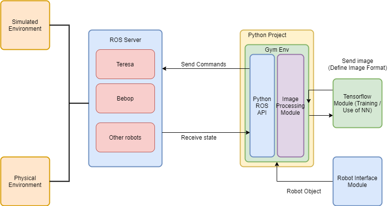
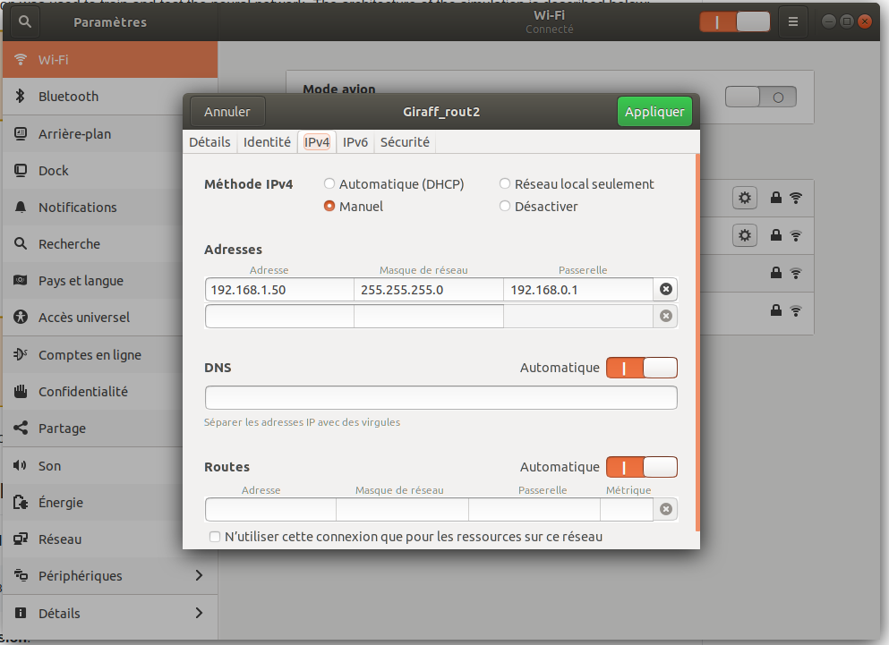

# Robot Teresa 
* [Description](#description)
* [Introduction](#introduction)
* [System Requirements](#system-requirements)
* [Installation](#installation)
* [Execute Simulation](#execute-simulation)
* [Execute with the real drone](#execute-with-the-real-drone)

# Description

This repo constitutes the continuation of the work done by :

**Daniel RODRIGUEZ**, Student at Telecom SudParis, Institut Polytechnique de Paris : (work on the simulation of Teresa for training the Dense neural Network)

- https://github.com/danielrs975/robot_controller

- https://github.com/danielrs975/teresa-simulation

**Saad Lahlali & Quentin Adi** (Student at Telecom SudParis, Institut Polytechnique de Paris) : (work on appplying the neural network on the Teresa Robot)

- https://github.com/saad2050lahlali/Teresa-Robot-Test 

**Pedro Branco & Gabriel Pires-Sobreira** (Student at Ensta Paris, Institut Polytechnique de Paris) : (work on a reinforcement learning with a drone)

- https://github.com/pedrobranco0410/Bebop-with-Reinforcement-Learning

Advisor: Prof. **Hossam Afifi** (Telecom SudParis, Institut Polytechnique de Paris)

This collaboration was made during my summer internship at Telecom SudParis. The project was the application of Reinforcement Learning in a Medical Robot to teach it the task to center a detected person in order later to teach him the task of following a person. 

For that, two neural networks were implemented on the Teresa robot with Gazebo simulator:
- a Dense Neural Network
- Dueling Deep Q learning algorithm with 
The filter haarcascdes was used to detect the body or the face of humans.

**Obervation**:
This filter is not optimal. In later works I advise to use CNN for detection and then a neural network for reinforcement learning.

# Introduction

The simulation was used to train and test the neural network. The architecture of the simulation is described below:

The same commands are used to train the robot on the simulator and to control the robot in real life.

# System Requirements

**Operational system**:

    Ubuntu 18.04
 
**Python Version**:

    Python 3.6.9

**Jupyter Notebook**:

    latest version
  

**create an environment of work**:

# Installation
You have to install all the dependencies manually, this includes:

1. Install [ROS melodic](http://wiki.ros.org/melodic/Installation/Ubuntu) (Install the Desktop-Full version)

2. Install [ROS bridge package](http://wiki.ros.org/rosbridge_suite)

    `$ sudo apt-get install ros-melodic-rosbridge-server`
4. Gazebo 9

3. Install Gazebo-ROS package

    `$ sudo apt-get install ros-melodic-gazebo-ros-pkgs ros-melodic-gazebo-ros-control`

# Execute the simulation
This part concerns the directories : Simulation-Teresa-with-Q-Learning and  Simulation-Teresa-with-Dense-Neural-Network

To run the simulation it will be necessary to use 4 terminals.

## 1. First Terminal

This terminal is responsable to launch roscore

`roscore`

## 2. Second Terminal
Launch simulation

`rosrun gazebo_ros gazebo ./teresa-simulation/gazebo_envs/Teresa_Lightweight.world`

## 3. Third Terminal

Launch ROS bridge

`roslaunch rosbridge_server rosbridge_websocket.launch`

(if you encounter an error about not installed rospk, just install it via : 

`pip3 install rospkg`

## 4. Fourth Terminal

Launch the jupyter notebook

`jupyter notebook`

or 

`anaconda-navigator`

chose the environment venv that you've created and launch the jupyternotebook from here

# Execute with the real robot
This part concerns the directories : Test-Teresa-with-Q-Learning and Test-Teresa-with-Dense-Neural-Network

To run with the real drone it is almost the same thing.It will be necessary to use 1 terminal.

## 1. wifi and camera

Turn on the giraff wifi and the camera (the configuration are already done you just have to aliment it through an external battery preferably to allow the robot to move freely).

## 2. On your PC

### 1.1 Open a terminal and launch roscore

`roscore`

### 1.2 Connect the PC to the camera and the robot through the wifi Giraff_rout2

configure the wifi as followed (the ip are defined in the jupyternotebooks)

## 3. On the robot PC

Launch ROS bridge

`roslaunch rosbridge_server rosbridge_websocket.launch`

you can lauch the jupyternotebooks you want in the Test directories.

# Control the robot via a keyboard

you can also control the robot manually via a keyboard. A keyboard is already connected and configured in the laboratory room. All you need is to open a terminal on the robot and run these commands For instance:

`ssh 192.168.1.13`

and then

`rosrun teleop_twist_keyboard teleop_twist_keyboard.py`

# Author and Advisor

**Lamia Salhi**, Student at Telecom SudParis and Eurecom, Institut Polytechnique de Paris

Advisor: Prof. **Hossam Afifi** (Telecom SudParis, Institut Polytechnique de Paris)

