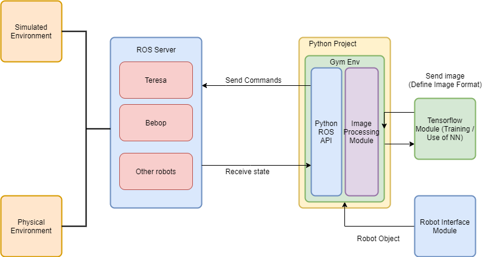

# PARROT Drone 
* [Description](#description)
* [Introduction](#introduction)
* [System Requirements](#system-requirements)
* [Installation](#installation)
* [Execute Simulation](#execute-simulation)
* [Execute with the real drone](#execute-with-the-real-drone)

# Description

Implementation of a Dueling Deep Q learning algorithm with parrot bebop2 drone and bebop2 sphinx parrot simulator. The aim it is to the drone identify and try to centralizate a person.

# Introduction

It was used the simulation to train the robot and test the neural network. The architecture of the simulation it is described inthe following image

The upside of using sphinx parrot simulator as the simulated environement to train the drone it is that the same commands used in the simulation have the same effect in the real robot.

# System Requirements

**Operational system**:

    Ubuntu 18.04

***observation***: By the time this project was developed there wasn't official version of the parrot sphinx simulator for ubuntu over 18.04. According to the official documantetion it supported by the followings linux distributions: 

    Ubuntu 16.04 (xenial)
    Ubuntu 18.04 (bionic)
    Debian 9 (stretch)
    Debian 10 (buster)
 
**Python Version**:

    Python 3.6.9

**Jupyter Notebook**:

    jupyter-notebook 6.0.3

# Installation

1. Install [ROS melodic](http://wiki.ros.org/melodic/Installation/Ubuntu) (Install the Desktop-Full version)

2. Install [ROS bridge package](http://wiki.ros.org/rosbridge_suite)

    `$ sudo apt-get install ros-melodic-rosbridge-server`

3. Install Gazebo-ROS package

    `$ sudo apt-get install ros-melodic-gazebo-ros-pkgs ros-melodic-gazebo-ros-control`

2. Install [Parrot Sphinx](https://developer.parrot.com/docs/sphinx/installation.html)

3. Install [Bebop_autonomy](https://bebop-autonomy.readthedocs.io/en/latest/installation.html)

    

# Execute the simulation

To run the simulation it will be necessary to use six terminals.

## 1. First Terminal

This terminal is responsable to launch roscore

`roscore`

## 2. Second Terminal
This terminal is responsable to launch the firmwared 

`sudo firmwared`

## 3. Third Terminal

Launch Simulation

`sphinx /opt/parrot-sphinx/usr/share/sphinx/drones/bebop2.drone`

**Observation:**
        
    The firt time to run the simulation before do so it is necessary open the drone file:

`sudo gedit /opt/parrot-sphinx/usr/share/sphinx/drones/bebop2.drone`

    Change the stolen interface parameter to the same as yours wi-fi. To check what is the parameter for yours wi-fi connection execute the following command in a terminal:

`iwconfig`
    
## 4. Fouth Terminal

Create bebop_autonomy node. This is responsable to habilitate the python script to control the simulation.

1. `source ~/bebop_ws/devel/setup.bash`

2. `export LD_LIBRARY_PATH=$LD_LIBRARY_PATH:/opt/ros/melodic/lib/parrot_arsdk/`

3. `roslaunch ~/bebop_ws/src/bebop_autonomy/bebop_driver/launch/bebop_node.launch`

**Observation:**
        
    As the simulation it is going to be executed make sure that the ip adress at the bebop_node.launch file it is 10.202.0.1. To do so open the launch file:

`sudo gedit ~/bebop_ws/src/bebop_autonomy/bebop_driver/launch/bebop_node.launch`

## 5. Fifth Terminal

Launch ROS bridge

`roslaunch rosbridge_server rosbridge_websocket.launch`

## 6. Sixth Terminal

Launch the jupyter notebook

`jupyter notebook`

# Execute with the real drone

To run with the real drone it is almost the same thing.It will be necessary to use ******** terminals.

## 1. First Terminal

This terminal is responsable to launch roscore

`roscore`

## 2. Second Terminal
Create bebop_autonomy node. This is responsable to habilitate the python script to control the simulation.

1. `source ~/bebop_ws/devel/setup.bash`

2. `export LD_LIBRARY_PATH=$LD_LIBRARY_PATH:/opt/ros/melodic/lib/parrot_arsdk/`

3. `roslaunch ~/bebop_ws/src/bebop_autonomy/bebop_driver/launch/bebop_node.launch`

**Observation:**
        
    As the simulation it is going to be executed make sure that the ip adress at the bebop_node.launch file it is 192.168.42.1. To do so open the launch file:

`sudo gedit ~/bebop_ws/src/bebop_autonomy/bebop_driver/launch/bebop_node.launch`

## 5. Third Terminal

Launch ROS bridge

`roslaunch rosbridge_server rosbridge_websocket.launch`

## 6. Fourth Terminal

Launch the jupyter notebook

`jupyter notebook`

# Get drone status

It is possible during the simulation or with the real drone to get some data from it, such as battery status (complete list in these [link1](https://bebop-autonomy.readthedocs.io/en/latest/reading.html) [link2](https://bebop-autonomy.readthedocs.io/en/latest/autogenerated/common_states_param_topic.html#commoncommonstateallstateschanged) [link3](https://bebop-autonomy.readthedocs.io/en/latest/autogenerated/ardrone3_states_param_topic.html))
To enable it is necessary edit the file:

`sudo gedit ~/bebop_ws/src/bebop_autonomy/bebop_driver/config/defaults.yaml`

In the file you should add the parameter for the desired data. For example, if you want to get the battery state the defaults.yaml file should have the following parameter:

`enable_commonstate_batterystatechanged: true`

## Visualize in the Terminal

To get this data in the terminal you must source it (`source ~/bebop_ws/devel/setup.bash`) and then use the command `rostopic echo <desired_topic>`. For example, for the battery:

first source it: `source ~/bebop_ws/devel/setup.bash`

then call rostopic echo: `rostopic echo /bebop2/states/common/CommonState/BaeryStateChanged > ~/Desktop/Bebop-git2/Bebop-with-Reinforcement-Learning/src/status/outputfile.txt`

**Observation**: change to the directory where you want to save the outputfile 

The topics for each parameters are specified in the links.